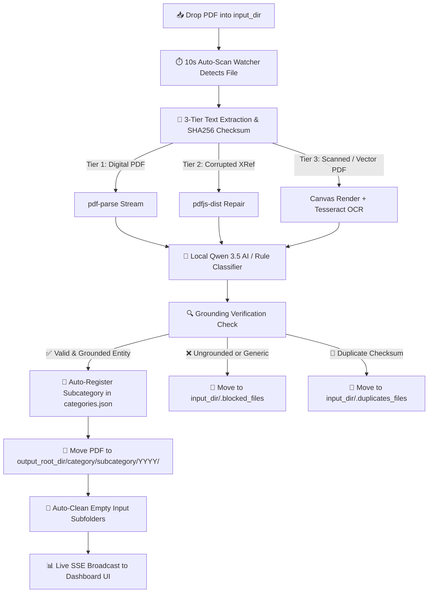

# 📁 Smart PDF Triage Dashboard

> **AI-Powered PDF Classification, Entity Extraction & Folder Sorting System**

An intelligent, privacy-first PDF classification, entity extraction, and automated document sorting system powered by local AI (**Qwen 3.5 via Ollama**).

---

## ⚙️ How the Application Mechanism Works



### 1. Automated Background Monitoring
The backend runs a **10-second non-blocking auto-scan watcher** monitoring your `input_dir` (e.g. `./input` or `__raws`). Any new PDF dropped into the input folder is detected automatically.

### 2. 3-Tiered PDF Extraction & Fallback Pipeline
- **Tier 1 — Standard PDF Parse**: Fast text stream extraction for native digital PDFs.
- **Tier 2 — `pdfjs-dist` Stream Repair**: Automatically repairs corrupted cross-reference tables (`bad XRef entry`) from web portal downloads.
- **Tier 3 — High-Fidelity Canvas Rasterization & Tesseract OCR**: Renders full PDF pages onto an in-memory 2D Canvas via `@napi-rs/canvas` and executes offline **Tesseract.js OCR**, capturing vector path PDFs (e.g. Tax Notices & Government Statements), sliced image strips, scanned passports, and paper receipts without memory errors.

### 3. Duplicate & Blocked File Relocation
- **Duplicates**: Files matching existing database checksums are safely relocated to `input_dir/.duplicates_files/` with automatic collision handling (`filename_dup1.pdf`).
- **Blocked Files**: Files failing taxonomy rules or without extractable text are safely moved to `input_dir/.blocked_files/` for user inspection.
- **Folder Cleanup**: `cleanEmptyDirectories` automatically prunes empty input subfolders after processing using Windows-safe file lock retries.

### 4. Intelligent Automatic Document Renaming
When a document has a generic or unhelpful input filename (e.g. `QPtmp001.PDF`, `invoice (8).pdf`, `scan_001.pdf`, `13320220423-recap.pdf`, or random hashes), the system automatically renames it using extracted AI metadata into a standardized human-readable format:
```text
YYYY-MM-DD_EntityName_CleanTitle.pdf
```
*Example: `QPtmp001.PDF` $\rightarrow$ `2023-07-31_AcmeCorp_Pay_Slip_July.pdf`*

### 5. Local Qwen 3.5 LLM Triage
Document text is sent to local **Qwen 3.5:9b via Ollama** to analyze context, assign canonical Categories, identify specific Subcategories (company, issuer, or vendor names), and extract metadata (title, date, summary, payment status).

### 6. Dynamic Auto-Registration & Fail Guard
- **Pre-Move Auto-Creation**: If a new valid subcategory slug is detected and verified, it is dynamically registered in `categories.json` BEFORE moving the file.
- **Strict Fail Guard**: If a document fails to resolve to a grounded, specific subcategory (e.g. receives `general` or ungrounded gibberish), it is moved to `.blocked_files/` — preventing generic folder clutter.

### 7. Physical Folder Filing & Real-Time Sync
Accepted PDFs are moved to canonical folder paths on disk:
```text
output_root_dir/category/subcategory/YYYY/filename.pdf
```
The SQLite FTS5 database (configured with WAL mode for non-blocking concurrent reads) and `registry.json` are updated in real-time, broadcasting live Server-Sent Events (SSE) to your browser dashboard.

### 8. Interactive HTML5 Web PDF Reader (`public/viewer.html`)
Clicking **`🌐 Open`** on document cards or **`🌐 Open in Chrome`** in the Grand Viewer launches a dedicated, full-screen Web PDF Reader tab powered by **Mozilla PDF.js**. PDF pages render cleanly on HTML5 canvas elements in dark mode without triggering browser "Save As" download prompts.

---

## 📥 How to Input Documents for Triage

### Method A: Drop Files into Input Folder (Automatic)
1. Copy or drop any PDF files (or nested subfolders containing PDFs) into your configured input directory (e.g. `./input` or `__raws`).
2. The background watcher detects them within 10 seconds, parses their text, classifies them, and moves them to `./organized` (`__archive`).

### Method B: Manual Scan Trigger from Dashboard
1. Open the Web Dashboard at `http://localhost:3971`.
2. Click **⚡ Scan & Triage PDFs** in the top navigation bar to trigger an instant triage scan across all unindexed files in your input directory.

---

## 📊 How to Open & Use the Web Dashboard

### 1. Launch the Server
Ensure Ollama is running, then start the web server in your terminal:
```bash
npm run dev
```

### 2. Open the Dashboard in Browser
Navigate to **`http://localhost:3971`** in Google Chrome, Microsoft Edge, Firefox, or Safari.

### 3. Interactive Dashboard Features

- 📂 **Category & Subcategory Pills**: Click any category pill (e.g. `Sales Invoices`, `Pay Slips`, `Identity & Legal`) or subcategory pill to instantly filter your document grid. Easily remove unused categories with zero documents using the interactive `❌` action buttons.
- 🌐 **Web PDF Reader**: Click **`🌐 Open`** on any document card to open a full-screen HTML5 canvas viewer tab powered by Mozilla PDF.js.
- 🔍 **Instant Full-Text Search (FTS5)**: Type keywords, reference numbers, or text content into the search bar to search across titles, summaries, tags, and raw PDF text in milliseconds.
- 📍 **📍 Relocalize & AI Feedback Button**:
  - Click **📍 Relocalize** on any document card to open the interactive modal.
  - Re-assign the category/subcategory, rename/edit subcategories, or select structured error reasons (*"Wrong Employer Name"*, *"Tax misclassified as Invoice"*) to teach and refine the local AI classifier.
- 📂 **Open Physical Explorer Folder**: Click **📂 Open Folder** on any document card to open Windows Explorer / OS File Manager directly at the exact PDF path on your computer.
- 🔧 **System Tools**:
  - **⚡ Scan & Triage PDFs**: Run immediate scan.
  - **🔧 Repair Registry**: Re-verify archive files and sync database.
  - **🗑️ Clear Registry**: Reset document records and return archive PDFs to input directory.
  - **⚙️ System Config**: Adjust input/output paths, language options (English / French), Ollama model hosts, and manage categories/subcategories.

---

## 🌟 Key Features

- 🧠 **100% Local AI Classification**: Runs locally using Ollama (`qwen3.5:9b`). Zero document data sent to external cloud APIs.
- 📐 **Modular TypeScript Frontend Architecture**: Clean, strongly-typed factory class design (`public/ts/`) compiled into standard browser scripts (`public/js/`).
- 📄 **HTML5 Canvas Web PDF Reader**: Embedded Mozilla PDF.js viewer page (`viewer.html`) for instant, high-definition inline page viewing without download dialogs.
- 🌐 **Multi-Language Support (EN & FR)**: Full internationalization for English and French UI labels, category display names, and AI prompt outputs.
- ✏️ **Intelligent Automatic Document Renaming**: Converts generic scanner dumps and temporary files (e.g. `QPtmp001.PDF`) into standardized, descriptive filenames (e.g. `2023-07-31_AcmeCorp_Pay_Slip_July.pdf`).
- 🖼️ **Full-Page Canvas Rasterization & Offline OCR**: Automatically extracts text from scanned photos, passports, sliced images, and vector path PDFs using `@napi-rs/canvas` and `Tesseract.js`.
- 🏢 **Multi-Tenant & Generic Architecture**: Built for Individuals, Families, Freelancers, SMBs, and Enterprise Corporations. Zero hardcoded personal names.
- 🧾 **Dual Invoice Triage**: Automatically distinguishes between **Client Sales Invoices** (`factures_clients`) and **Supplier Purchase Invoices** (`invoices`).
- 💳 **Payment Status Tracking**: Automatically extracts payment signals and tags invoices as `PAID` or `UNPAID / PENDING`.
- 🏦 **Dedicated Banking & Statements Category (`bank`)**: Cleanly separates Bank Statements (Crédit Mutuel, Société Générale, BNP Paribas, BoursoBank, LCL, La Banque Postale, PayPal) into a dedicated top-level category out of `administrative`.
- 🪪 **Identity & Legal Document Sorting**: Intelligent routing for Residence Permits, Passports, ID Cards, Tax Notices, and Pay Slips.
- ⚡ **High Performance Grid**: SQLite WAL mode + lightweight 300-char preview snippets for 100x faster API response times and instant 0ms reader modal feedback.
- 🛡️ **Strict Fail Guard & Duplicate Relocation**: Automatically separates duplicates (`.duplicates_files/`) and unclassified files (`.blocked_files/`), keeping input directories completely clean.

---

## 🛠️ Technology Stack

- **Core Engine**: TypeScript, Node.js, Express
- **Frontend Architecture**: Modular TypeScript (`public/ts/`) compiled to Vanilla JS (`public/js/`), Mozilla PDF.js Reader (`viewer.html`)
- **AI / LLM**: Ollama (`qwen3.5:9b`), Local Embeddings (`nomic-embed-text`)
- **Database**: SQLite3 with WAL Mode & FTS5 Full-Text Search
- **PDF Extraction**: `pdf-parse`, `pdfjs-dist`, `@napi-rs/canvas`, `Tesseract.js` (Offline OCR)
- **Desktop Shell**: Electron, Electron-Builder
- **Testing & Build**: Vitest, ESBuild, TypeScript Compiler (`tsc`)

---

## 🚀 Quick Start

### 💻 System Requirements

Smart PDF Triage runs 100% locally on your computer using Node.js, Electron, SQLite, `@napi-rs/canvas`, `Tesseract.js` (offline OCR), and local AI LLMs via **Ollama**.

#### 🔹 Minimum System Requirements (CPU Mode)
| Component | Requirement |
| :--- | :--- |
| **Operating System** | Windows 10/11 (64-bit), macOS 11+, or Linux (Ubuntu 20.04+) |
| **CPU** | Quad-Core x86-64 / ARM processor (with AVX2 support) |
| **System RAM** | **8 GB RAM** |
| **Graphics (GPU)** | Integrated Graphics — *CPU fallback supported by Ollama* |
| **Free Storage** | **10 GB available SSD space** (5.5 GB for Qwen 3.5 9B model + 4.5 GB for app & PDF database) |

#### 🚀 Recommended System Requirements (GPU / AI Accelerated Mode)
| Component | Requirement |
| :--- | :--- |
| **Operating System** | Windows 11 (64-bit) or macOS Apple Silicon (M1/M2/M3) |
| **CPU** | 6-Core / 8-Core processor (Intel 10th Gen+ / AMD Ryzen 3000+ / Apple M-series) |
| **System RAM** | **16 GB RAM** or higher |
| **Graphics (GPU)** | NVIDIA GPU with **6 GB+ VRAM** (CUDA support) or Apple Silicon Unified Memory |
| **Free Storage** | **20 GB+ available NVMe SSD space** |

> 💡 **Tip**: If running on an 8 GB RAM PC without a dedicated GPU, you can use lighter Ollama models like `qwen2.5:3b` or `qwen2.5:7b` by updating `ollama_model` in `settings.json`.

---

### 1. Prerequisites
- **Node.js** v18+ or v20+ installed.
- **Ollama** installed locally ([ollama.com](https://ollama.com)).
- Pull model:
  ```bash
  ollama pull qwen3.5:9b
  ```

### 2. 🚀 Initial Setup & Startup for a New Repository (From Zero)
When setting up `smart-pdf-triage` on a new computer or for a new user starting from scratch:

#### Step 1: Install Ollama & Start Local AI Service
Download and install [Ollama](https://ollama.com). Ensure the local AI service is running and pull the Qwen 3.5 9B model:
```bash
ollama serve
ollama pull qwen3.5:9b
```

#### Step 2: Clone Repository & Install Node Dependencies
```bash
git clone https://github.com/phamhung075/smart-pdf-triage.git
cd smart-pdf-triage
npm install
```

#### Step 3: Configure Settings & Directories
Copy the template `settings.json.example` to `settings.json`:
```bash
cp settings.json.example settings.json
```
Customize `input_dir` (where incoming PDFs arrive) and `output_root_dir` (where organized PDFs are filed) in `settings.json`:
```json
{
  "language": "EN",
  "input_dir": "./input",
  "output_root_dir": "./organized",
  "ollama_model": "qwen3.5:9b",
  "ollama_host": "http://127.0.0.1:11434"
}
```
> 💡 **Automatic Directory Initialization**: On launch, the server automatically initializes all necessary folder structures (`./input`, `./organized`, `.blocked_files`, `.duplicates_files`, `.delete_files`), `categories.json`, and the SQLite database (`pdf_triage.db`) if they do not exist yet.

#### Step 4: Run the Application
- **Development Mode** (API & Web Dashboard on `http://localhost:3971`):
  ```bash
  npm run dev
  ```
- **Build Frontend TypeScript**:
  ```bash
  npm run build:frontend
  ```
- **Desktop Electron App Mode** (Native Window with System Tray):
  ```bash
  npm run desktop
  ```
- **Build Portable Desktop Installer (.exe)**:
  ```bash
  npm run build
  npm run dist:exe
  ```

---

## 🧪 Testing & Code Quality

```bash
# Run all 272 unit tests
npm test

# Run TypeScript type check & frontend build
npm run build:frontend
npx tsc --noEmit
```

---

## 📄 License

MIT License. Free for personal, commercial, and enterprise use.
