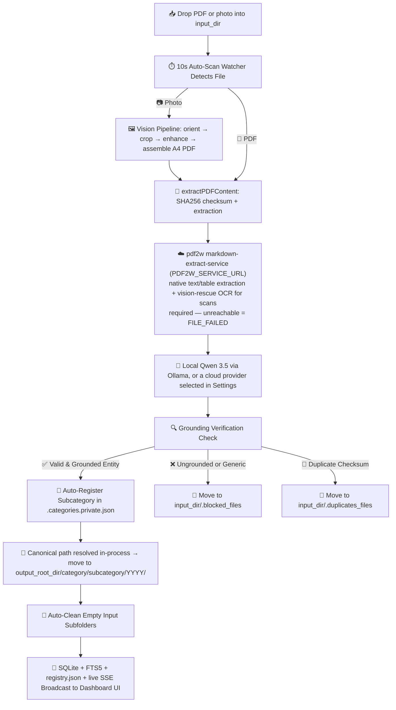

# 📁 Smart PDF Triage Dashboard

> **AI-Powered PDF Classification, Entity Extraction & Folder Sorting System**

An intelligent, privacy-first PDF classification, entity extraction, and automated document sorting system powered by local AI (**Qwen 3.5 via Ollama**, with optional cloud providers).

---

## ⚙️ How the Application Mechanism Works


```mermaid
flowchart TD
    A[📥 Drop PDF or photo into input_dir] --> B[⏱️ 10s Auto-Scan Watcher Detects File]
    B -->|📷 Photo| P["🖼️ Vision Pipeline: orient → crop → enhance → assemble A4 PDF"]
    P --> C[🔎 extractPDFContent: SHA256 checksum + extraction]
    B -->|📄 PDF| C
    C --> C1["☁️ pdf2w markdown-extract-service (PDF2W_SERVICE_URL)<br/>native text/table extraction + vision-rescue OCR for scans<br/>required — unreachable = FILE_FAILED"]
    C1 --> G[🧠 Local Qwen 3.5 via Ollama, or a cloud provider selected in Settings]
    G --> H[🔍 Grounding Verification Check]
    H -->|✅ Valid & Grounded Entity| I[💾 Auto-Register Subcategory in .categories.private.json]
    H -->|❌ Ungrounded or Generic| J[📁 Move to input_dir/.blocked_files]
    H -->|🔁 Duplicate Checksum| K[📂 Move to input_dir/.duplicates_files]
    I --> L[📁 Canonical path resolved in-process → move to output_root_dir/category/subcategory/YYYY/]
    L --> M[🧹 Auto-Clean Empty Input Subfolders]
    M --> N[💾 SQLite + FTS5 + registry.json + live SSE Broadcast to Dashboard UI]
```

### 1. Automated Background Monitoring
The backend runs a **10-second non-blocking auto-scan watcher** monitoring your `input_dir` (e.g. `./input` or `__raws`). Any new PDF **or photo** dropped into the input folder is detected automatically — phone photos of documents (`.jpg`, `.png`, `.webp`, `.bmp`, `.tiff`) are converted to PDFs before triage (see below).

### 2. PDF Text Extraction & OCR (External pdf2w Service)
- **One path for every file**: the raw bytes are POSTed to the external, self-hosted **pdf2w** `markdown-extract-service` (`POST /convert`), reached via `PDF2W_SERVICE_URL` (default `http://127.0.0.1:3984`) from the `infra/pdf2w` package.
- **Native extraction + vision-rescue OCR**: pdf2w does native PDF text/table extraction and runs its own vision-rescue OCR for scanned or image-only pages. Photos assembled into PDFs get their text from this exact same call.
- **Required, no local fallback**: if the service is unreachable, the file is `FILE_FAILED`. pdf-triage runs no OCR engine of its own.
- **Checksum**: the SHA-256 used for duplicate detection is computed locally.

### 2b. Photo → Archivable PDF (Vision Pipeline)
A photographed document is not an archivable document, so photos are converted before they ever reach the classifier:

1. **Orient** — corrects rotation with the pinned Ollama vision model (`minicpm-v4.6:latest`); the buffer was already EXIF-normalized (Golden Rule 17), so EXIF is never re-applied and the model's answer is the deciding signal. If the model call fails, the photo is filed as-is.
2. **Crop** — arbitrates the vision model's crop box against a local, deterministic flood-fill edge detector. If the document already fills the frame (scans, close-ups, re-runs), the crop is **vetoed** rather than cutting into the page.
3. **Enhance** — auto-levels and sharpening; the stage still runs, but its output is no longer read or archived (the cropped, natural-toned page is what gets filed).
4. **Assemble** — the orient/crop result is fitted to A4 and written as an image-only PDF; its text then comes from the same pdf2w `POST /convert` call every other PDF uses.

The archived PDF holds the **cropped, natural-toned** page (not the enhanced one, whose hard contrast can crush faint stamps and signatures), fitted to A4. Every geometry stage degrades safely — a failed orientation or crop leaves the page untouched and still yields a PDF.

**Your original photo is never deleted.** Once the PDF is confirmed on disk, the source moves to `__raws/.delete_files/img_converted/` rather than being unlinked: the PDF holds a cropped, re-encoded rendition, so if the crop detector ever clips part of a page the untouched original is the only way back. Nothing prunes that folder — it grows until you clear it.

**Multi-page documents: drop a folder.** A folder in `__raws` holding only photos (2 or more) is bundled into **one** multi-page PDF named after the folder, instead of becoming several unrelated one-page documents:

```
__raws/
  contrat-bail/          →  contrat-bail.pdf   (3 pages, one document)
    IMG_1.jpg
    IMG_2.jpg
    IMG_3.jpg
  facture-edf.jpg        →  facture-edf.pdf    (1 page, as before)
```

Pages are ordered numerically, so `IMG_2` comes before `IMG_10` — plain alphabetical sorting silently shuffles any document with ten or more photos. Each page's extracted text is concatenated so the classifier reads the whole document at once, and the source pages stay grouped under `.delete_files/img_converted/contrat-bail/`.

A folder qualifies only if it holds **2+ images and nothing else**. A lone photo isn't a multi-page document, and a folder where you also keep a PDF is storage you're using — fusing its photos would be a destructive guess, so it's left alone and triaged file by file.

### 3. Duplicate & Blocked File Relocation
- **Duplicates**: Files matching existing database checksums are safely relocated to `input_dir/.duplicates_files/` with automatic collision handling (`filename_dup1.pdf`).
- **Blocked Files**: Files failing taxonomy rules or without extractable text are safely moved to `input_dir/.blocked_files/` for user inspection.
- **Folder Cleanup**: `cleanEmptyDirectories` automatically prunes empty input subfolders after processing using Windows-safe file lock retries.

### 4. Intelligent Automatic Document Renaming
When a document has a generic or unhelpful input filename (e.g. `QPtmp001.PDF`, `invoice (8).pdf`, `scan_001.pdf`, `13320220423-recap.pdf`, or random hashes), the system automatically renames it using extracted AI metadata into a standardized human-readable format:
```text
YYYY-MM-DD_EntityName_CleanTitle.pdf
```
*Example: `QPtmp001.PDF` $\rightarrow$ `2023-07-31_AcmeCorp_Pay_Slip_July.pdf`*

### 5. Modular Local AI Pipeline (Qwen 3.5 via Ollama)
Rather than one giant prompt trying to do everything at once, each document runs through three focused local-model passes:
- **Step A — Entity Extraction**: a narrow, dedicated pass identifies the issuing entity and document type first, more reliably than hoping a single freeform call gets both the entity *and* the category right.
- **Step B — Zero-Loss Markdown Conversion**: raw extracted text is chunked and converted into clean, structured GFM Markdown (headers, tables) — this becomes the document's `markdown_content`, used for display, search, and export.
- **Step C — Classification**: the converted Markdown, plus Step A's entity as a grounded hint, drives the final category/subcategory/summary/metadata decision.

### 6. Dynamic Auto-Registration & Fail Guard
- **Public/Private Taxonomy Split**: `categories.json` (committed, generic starter categories) stays clean and shareable; every category/subcategory actually auto-created from *your* documents (real bank branches, employers, etc.) is written to `.categories.private.json` instead — gitignored, never leaves your machine if you fork or publish your own copy of this project.
- **Pre-Move Auto-Creation**: a new valid subcategory slug is registered BEFORE moving the file.
- **Strict Fail Guard**: if a document fails to resolve to a grounded, specific subcategory (e.g. receives `general` or ungrounded gibberish), it is moved to `.blocked_files/` — preventing generic folder clutter.

### 7. Physical Folder Filing & Real-Time Sync
Accepted PDFs are moved to canonical folder paths on disk:
```text
output_root_dir/category/subcategory/YYYY/filename.pdf
```
The SQLite FTS5 database (configured with WAL mode for non-blocking concurrent reads) and `registry.json` are updated in real-time, broadcasting live Server-Sent Events (SSE) to your browser dashboard.

### 8. Interactive HTML5 Web PDF Reader (`public/viewer.html`)
Clicking **`🌐 Open`** on document cards or **`🌐 Open in Chrome`** in the Grand Viewer launches a dedicated, full-screen Web PDF Reader tab powered by **Mozilla PDF.js**. PDF pages render cleanly on HTML5 canvas elements in dark mode without triggering browser "Save As" download prompts.

---

## 📥 How to Input Documents for Triage

### Method A: Drop Files into Input Folder (Automatic)
1. Copy or drop any PDF files (or nested subfolders containing PDFs) into your configured input directory (e.g. `./input` or `__raws`).
2. The background watcher detects them within 10 seconds, parses their text, classifies them, and moves them to `./organized` (`__archive`).

### Method B: Manual Scan Trigger from Dashboard
1. Open the Web Dashboard at `http://localhost:3971`.
2. Click **⚡ Scan & Triage PDFs** in the top navigation bar to trigger an instant triage scan across all unindexed files in your input directory.

---

## 📊 How to Open & Use the Web Dashboard

### 1. Launch the Server
Ensure Ollama is running, then build and start the server in your terminal:
```bash
make build            # dashboard assets + dist/pdf-triage
./dist/pdf-triage serve
```

> **Extraction service**: all PDF/photo text extraction (including OCR for scanned pages) is
> delegated to the external, self-hosted **pdf2w** `markdown-extract-service`, reached through
> `PDF2W_SERVICE_URL` (default `http://127.0.0.1:3984`). pdf-triage runs no OCR of its own.

### 2. Open the Dashboard in Browser
Navigate to **`http://localhost:3971`** in Google Chrome, Microsoft Edge, Firefox, or Safari.

### 3. Interactive Dashboard Features

- 📂 **Category & Subcategory Pills**: Click any category pill (e.g. `Sales Invoices`, `Pay Slips`, `Identity & Legal`) or subcategory pill to instantly filter your document grid. Easily remove unused categories with zero documents using the interactive `❌` action buttons.
- 🌐 **Web PDF Reader**: Click **`🌐 Open`** on any document card to open a full-screen HTML5 canvas viewer tab powered by Mozilla PDF.js.
- 🔍 **Instant Full-Text Search (FTS5)**: Type keywords, reference numbers, or text content into the search bar to search across titles, summaries, tags, and raw PDF text in milliseconds.
- 📍 **📍 Relocalize & AI Feedback Button**:
  - Click **📍 Relocalize** on any document card to open the interactive modal.
  - Re-assign the category/subcategory, rename/edit subcategories, or select structured error reasons (*"Wrong Employer Name"*, *"Tax misclassified as Invoice"*) to teach and refine the local AI classifier.
- 📂 **Open Physical Explorer Folder**: Click **📂 Open Folder** on any document card to open Windows Explorer / OS File Manager directly at the exact PDF path on your computer.
- 💬 **AI Chat Assistant**: Ask questions in plain language ("my last 3 pay slips", "any documents from URSSAF this year?") and get answers grounded in your own indexed archive — answered by local Ollama by default, or by the cloud provider you select in Settings.
- 📝 **Markdown Export**: Download any single document's converted Markdown as a `.md` file from the Grand Viewer, or export every indexed document's Markdown at once as a ZIP.
- 📊 **Group by Document Session**: The Logs modal groups every log line by the document that produced it, so you can see exactly what happened (extraction → entity → classification → filing) for one specific file.
- 🔧 **System Tools**:
  - **⚡ Scan & Triage PDFs**: Run immediate scan (with a live Stop button while it's running).
  - **🔧 Repair Registry**: Re-verify archive files and sync database.
  - **🗑️ Clear Registry**: Reset document records and return archive PDFs to input directory.
  - **⚙️ System Config**: Adjust input/output paths, language options (English / French), Ollama model hosts, and manage categories/subcategories.

### 4. MCP Server — Connect External AI Agents

`./dist/pdf-triage mcp` starts a stdio-based [Model Context Protocol](https://modelcontextprotocol.io) server exposing your document registry as tools: `search_documents`, `get_full_document_text`, `update_document_metadata`, `trigger_triage`, `list_categories`, `prepare_dossier`. Point Claude Desktop (or any other MCP-capable client) at it to query and reason over your archive directly — your documents never leave your machine; only the MCP client's own queries and the tool results cross that boundary, and both stay local since the tool itself runs locally.

---

## 🌟 Key Features

- 🧠 **Local AI by Default**: Classification runs locally using Ollama (`qwen3.5:9b`) — document data stays on your machine. A cloud provider (Google, Claude, DeepSeek, OpenAI) is an explicit, optional choice in Settings.
- 📐 **Modular TypeScript Frontend Architecture**: Clean, strongly-typed factory class design (`public/ts/`) compiled into standard browser scripts (`public/js/`).
- 📄 **HTML5 Canvas Web PDF Reader**: Embedded Mozilla PDF.js viewer page (`viewer.html`) for instant, high-definition inline page viewing without download dialogs.
- 🌐 **Multi-Language Support (EN & FR)**: Full internationalization for English and French UI labels, category display names, and AI prompt outputs.
- ✏️ **Intelligent Automatic Document Renaming**: Converts generic scanner dumps and temporary files (e.g. `QPtmp001.PDF`) into standardized, descriptive filenames (e.g. `2023-07-31_AcmeCorp_Pay_Slip_July.pdf`).
- 🖼️ **External Extraction & OCR**: All PDF and photo text extraction — including OCR of scanned or image-only pages — is delegated to the external, self-hosted pdf2w `markdown-extract-service` (`PDF2W_SERVICE_URL`); pdf-triage runs no OCR of its own.
- 📷 **Phone Photos Become PDFs**: Drop a photo of a document and it is auto-oriented, cropped to the page, fitted to A4, and filed as a clean single-page PDF alongside your other documents.
- 🏢 **Multi-Tenant & Generic Architecture**: Built for Individuals, Families, Freelancers, SMBs, and Enterprise Corporations. Zero hardcoded personal names.
- 🧾 **Dual Invoice Triage**: Automatically distinguishes between **Client Sales Invoices** (`factures_clients`) and **Supplier Purchase Invoices** (`invoices`).
- 💳 **Payment Status Tracking**: Automatically extracts payment signals and tags invoices as `PAID` or `UNPAID / PENDING`.
- 🏦 **Dedicated Banking & Statements Category (`bank`)**: Cleanly separates Bank Statements (Crédit Mutuel, Société Générale, BNP Paribas, BoursoBank, LCL, La Banque Postale, PayPal) into a dedicated top-level category out of `administrative`.
- 🪪 **Identity & Legal Document Sorting**: Intelligent routing for Residence Permits, Passports, ID Cards, Tax Notices, and Pay Slips.
- ⚡ **High Performance Grid**: SQLite WAL mode + lightweight 300-char preview snippets for 100x faster API response times and instant 0ms reader modal feedback.
- 🛡️ **Strict Fail Guard & Duplicate Relocation**: Automatically separates duplicates (`.duplicates_files/`) and unclassified files (`.blocked_files/`), keeping input directories completely clean.
- 💬 **Local AI Chat Assistant**: Query your own document registry in natural language, answered by the local model.
- 🔌 **MCP Server**: Exposes your archive to any MCP-capable AI agent (Claude Desktop and others) via `search_documents`, `get_full_document_text`, `update_document_metadata`, `trigger_triage`, `list_categories`, `prepare_dossier`.
- 📝 **Markdown Export**: Per-document `.md` download, or a one-click ZIP of every document's converted Markdown.
- 🔒 **Locked to localhost by default (no auth)**: the web server binds to `127.0.0.1` only and ships with no CORS headers, but it has no Host-header check and no authentication layer — do not expose it beyond localhost. Setting `PDF_TRIAGE_HOST` to a non-loopback address exposes the dashboard, the API and the stored settings to that network.

---

## 🔐 Privacy & Security

This project exists because sending ID cards, bank statements, and tax records to a third-party cloud API wasn't an option. A few concrete things that back that up, not just marketing copy:

- **AI stays local by default.** Classification, entity extraction, embeddings, and the chat assistant run through your own local Ollama instance. Cloud AI providers (Google, Claude, DeepSeek, OpenAI) are available, but only as an explicit opt-in in Settings — with none selected, nothing about a document's content is sent to a cloud API.
- **Cloud API keys never come back to the browser.** A configured key is stored in plain text in `settings.json` in the data directory (`DATA_DIR`), which the server writes with mode `0600`. `GET` and `PUT /api/config` answer with `*_api_key_set` booleans only — never the key value; saving an empty key field keeps the stored key, and there is deliberately no API way to clear it.
- **No auth, so it's locked to your machine instead.** The dashboard has no login system and no Host-header check; it relies on binding to `127.0.0.1` by default. It ships with no CORS headers, which stops another origin from reading the API via `fetch()`, but that is not access control — a local process, or a tab navigated to the port, can still call it. Do not expose the port beyond localhost.
- **Personal taxonomy stays out of git.** If you fork this repo for your own use, every category/subcategory your documents actually create goes to `.categories.private.json` (gitignored) — the committed `categories.json` never picks up your real bank branches, employers, or any other entity extracted from your documents.
- **So do your classification prompts.** The files in `prompts/` are committed and deliberately generic. Anything that identifies you — your bank's statement filename codes, your employers, your scanner's filename prefix, your clinic — lives in `.prompts.private.json` (gitignored), injected into the prompt at build time and matched by the offline fallback classifier from that same file, so the two never drift apart. A repo-tree personal-data scan is the intended CI guard (open item; the old TypeScript prompt-hygiene test was retired at cutover).
- **No telemetry, no update pings, no analytics.** The network calls this app makes are to your own local Ollama instance, the self-hosted pdf2w extractor (`PDF2W_SERVICE_URL`), and — only if you select one — the cloud AI provider you configured.

If you do want to expose the dashboard beyond your own machine (e.g. to reach it from your phone on the same network), that's an explicit opt-in via `PDF_TRIAGE_HOST` in `.env` — but be aware that a non-loopback value exposes the dashboard, the API and the stored settings to that network, and there is still no authentication layer or Host-header check.

---

## 🛠️ Technology Stack

- **Core Engine**: Go 1.23 — one static, CGO-free binary `pdf-triage` (`serve | scan | mcp | vision-lab`), built by `make build` into `dist/pdf-triage`
- **Frontend Architecture**: Modular TypeScript (`public/ts/`) compiled to Vanilla JS (`public/js/`), SCSS compiled to `public/style.css`, HTML5 canvas PDF reader (`viewer.html`, Mozilla PDF.js), `marked` (vendored locally, not loaded from a CDN)
- **AI / LLM**: Local Ollama (`qwen3.5:9b`), local embeddings (`nomic-embed-text`); optional cloud provider (Google, Claude, DeepSeek, OpenAI) selected in Settings
- **Agent Integration**: Model Context Protocol server (`github.com/modelcontextprotocol/go-sdk`, stdio + streamable HTTP)
- **Database**: SQLite via `modernc.org/sqlite` (pure Go), WAL mode & FTS5 full-text search
- **PDF Extraction**: external, self-hosted pdf2w `markdown-extract-service` (`PDF2W_SERVICE_URL`)
- **Photo → PDF**: Go image pipeline (`golang.org/x/image`, `github.com/pdfcpu/pdfcpu`) — orientation, crop, enhancement, A4 assembly
- **Testing & Build**: Go test suite (`make test`), TypeScript Compiler (`tsc`), Sass

---

## 🚀 Quick Start

### 💻 System Requirements

Smart PDF Triage runs 100% locally by default on your computer as one static, CGO-free Go binary with SQLite (pure-Go `modernc.org/sqlite`), local AI via **Ollama** (`qwen3.5:9b`), and the external, self-hosted **pdf2w** extractor. No runtime beyond the Go binary is required to run it — TypeScript and pnpm are needed only to build the browser dashboard. A cloud AI provider (Google, Claude, DeepSeek, OpenAI) is an optional, opt-in choice in Settings — when enabled it sends document text to the chosen provider; with none selected, document text stays local.

#### 🔹 Minimum System Requirements (CPU-only Ollama)
| Component | Requirement |
| :--- | :--- |
| **Operating System** | Windows 10/11 (64-bit), macOS 11+, or Linux (Ubuntu 20.04+) |
| **CPU** | Quad-Core x86-64 / ARM processor (with AVX2 support) |
| **System RAM** | **16 GB** — the 9.7B model needs ~6.6 GB of it when Ollama has no GPU; the Go binary's own footprint is not measured here, and pdf2w runs as a separate service with its own footprint |
| **Graphics (GPU)** | None — Ollama falls back to CPU. Expect classification to go from seconds to minutes per document. |
| **Free Storage** | **12 GB** (see the breakdown below) |

#### 🚀 Recommended System Requirements (GPU accelerated)
| Component | Requirement |
| :--- | :--- |
| **Operating System** | Windows 11 (64-bit) or macOS Apple Silicon (M1/M2/M3) |
| **CPU** | 8-Core or better |
| **System RAM** | **16 GB** or higher |
| **Graphics (GPU)** | NVIDIA GPU with **8 GB VRAM** (CUDA) or Apple Silicon Unified Memory |
| **Free Storage** | **20 GB+** NVMe SSD, plus room for your archived documents |

> ⚠️ **8 GB VRAM is the real floor, not 6 GB.** `qwen3.5:9b` is 6.6 GB resident and the app runs it
> at `num_ctx: 16384`. Measured on an RTX 3060 Ti (8 GB): the model loads at **100% GPU** and leaves
> **582 MB free** — it fits, but only just. On a 6 GB card Ollama offloads layers to CPU and
> classification slows by roughly an order of magnitude. Anything else competing for VRAM (a game, a
> video call, a second model) causes the same demotion.

#### 💾 Storage breakdown (measured)

| Item | Size | |
| :--- | ---: | :--- |
| `qwen3.5:9b` (Ollama) | 6.6 GB | required for local classification |
| `minicpm-v4.6:latest` (Ollama vision) | 1.6 GB | photo pipeline only — orientation and crop |
| `node_modules/` | 0.03 GB | frontend build toolchain (pnpm) only |
| pdf2w `markdown-extract-service` | external | separate self-hosted install with its own repo/compose on `:3984` — footprint not measured here |
| SQLite DB + JSON registry | **≈158 KB per document** | 139 documents measured at 21.5 MB |
| `logs/triage_debug.log` | rotates at 5 MB | keeps 3 generations; configurable via `PDF_TRIAGE_LOG_MAX_BYTES` / `PDF_TRIAGE_LOG_RETAIN` |
| `__raws/.delete_files/img_converted/` | grows unbounded | converted photo sources are never pruned — clear it yourself |

**≈ 8.2 GB** for a full install (Ollama models + frontend build toolchain) before you archive a
single document. The archive itself is your own PDFs, wherever `settings.json` points.

> 💡 **The local model is not configurable.** Setting `ollama_model` in `settings.json` to anything
> other than `qwen3.5:9b` is **ignored** — `sanitizeOllamaModel()` logs a warning and forces it back,
> per Golden Rule #14. A lighter local model is not a supported way to fit a smaller machine; use CPU
> mode and more RAM instead, or select a cloud provider in Settings.

---

### 1. Prerequisites
- **Ollama** installed locally ([ollama.com](https://ollama.com)).
- Pull the classifier (required — this exact tag, see Golden Rule #14):
  ```bash
  ollama pull qwen3.5:9b
  ```
- **pdf2w extractor**: the external, self-hosted `markdown-extract-service`, running separately (default `http://127.0.0.1:3984`, configured via `PDF2W_SERVICE_URL`). It is required — all PDF/photo text extraction and OCR happen there, and an unreachable service fails the file.
- Pull the vision model (optional, 1.6 GB — needed by the photo pipeline's orientation and crop stages; without it a photo is filed as-is):
  ```bash
  ollama pull minicpm-v4.6
  ```
- **Optional, only for the frontend build**: Node.js + pnpm to compile `public/ts` → `public/js` and `public/scss` → `public/style.css`. The server binary itself is static and CGO-free — no bundled runtime and no native toolchain.

### 2. 🚀 Initial Setup & Startup for a New Repository (From Zero)
When setting up `smart-pdf-triage` on a new computer or for a new user starting from scratch:

#### Step 1: Install Ollama & Start Local AI Service
Download and install [Ollama](https://ollama.com). Ensure the local AI service is running and pull the Qwen 3.5 9B model:
```bash
ollama serve
ollama pull qwen3.5:9b
```

#### Step 2: Clone Repository
```bash
git clone https://github.com/phamhung075/smart-pdf-triage-local-ai.git
cd smart-pdf-triage-local-ai
```

#### Step 3: Configure Settings & Directories
Copy the template `settings.json.example` to `settings.json`:
```bash
cp settings.json.example settings.json
```
Customize `input_dir` (where incoming PDFs arrive) and `output_root_dir` (where organized PDFs are filed) in `settings.json`:
```json
{
  "language": "EN",
  "input_dir": "./input",
  "output_root_dir": "./organized",
  "ollama_model": "qwen3.5:9b",
  "ollama_host": "http://127.0.0.1:11434"
}
```
> 💡 **Automatic Directory Initialization**: On launch, the server automatically initializes all necessary folder structures (`./input`, `./organized`, `.blocked_files`, `.duplicates_files`, `.delete_files`) and the SQLite database (`pdf_triage.db`) if they do not exist yet.

Alternatively (or in addition), copy `.env.example` to `.env` and set any of `PDF_TRIAGE_BASE_DIR`, `PDF_INPUT_DIR`, `PDF_OUTPUT_DIR`, `PDF_TRIAGE_HOST`, `PORT`, `OLLAMA_HOST`, `OLLAMA_MODEL`, `OLLAMA_EMBED_MODEL`, `OLLAMA_VISION_MODEL`, `PDF2W_SERVICE_URL`, `SYSTEM_LANGUAGE` — see the file for what each one does. `settings.json` (via the Settings modal in the UI) is the friendlier way to change input/output folders and language day-to-day; `.env` is for things you set once per install.

`categories.json` (the generic starter taxonomy) is committed and needs no setup. Everything auto-created from your own documents goes to `.categories.private.json` instead, which is gitignored — see the `store/categories` Go package (`services/pdf-triage-pdf2w/store/categories`) if you're curious how the two get merged.

**Optional — teach the classifier about your own documents.** If your bank writes statement filenames as codes, or your scanner prefixes files, or you want a specific employer always filed a certain way, copy the template and edit it:
```bash
cp prompts.private.json.example .prompts.private.json
```
It holds a list of known entities and a set of keyword → category/subcategory overrides that are evaluated *before* the generic decision flow. The file is gitignored, it is read fresh on every classification (so edits take effect without restarting), and an invalid file is logged and ignored rather than breaking triage. Skipping this is completely fine — the prompts work generically without it.

#### Step 4: Run the Application
- **Build everything** (dashboard assets + the static Go binary at `dist/pdf-triage`):
  ```bash
  pnpm install          # once, for the frontend toolchain (sass + typescript)
  make build
  ```
- **Serve** (API & Web Dashboard on `http://localhost:3971`; the operator runs this, never the agent):
  ```bash
  ./dist/pdf-triage serve
  ```
- **Live-reload dev mode** (frontend watchers + Go hot-reload; the operator runs this too):
  ```bash
  make dev
  ```
- **Build Frontend TypeScript only** (run this after editing any `public/ts/*.ts` file — nothing recompiles it automatically):
  ```bash
  pnpm run build:frontend
  ```
- **Run the Go test suite**: `make test`.
- **Other subcommands**: `./dist/pdf-triage scan`, `./dist/pdf-triage mcp`, `./dist/pdf-triage vision-lab`.

---

## 🧪 Testing & Code Quality

```bash
# Run the full Go test suite (the backend is one Go module in services/pdf-triage-pdf2w)
make test

# Type-check the frontend TypeScript (no emit)
pnpm run typecheck
```

---

## 📄 License

[MIT License](LICENSE). Free for personal, commercial, and enterprise use.
