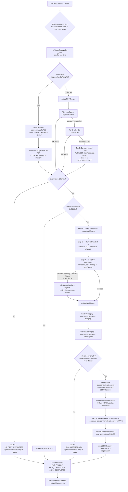

# 🏛️ Architecture

## Document flow

How one file moves from `__raws` to `__archive`, verified against `application/triage-scan.ts`, `application/convert-image-document.ts`, `application/classify-document.ts`, `domain/classification-resolution.ts`, and `domain/taxonomy.ts`. See [triage-pipeline](../workflows/triage-pipeline.md) for the numbered step-by-step version this diagram summarizes.



Notes:
- The image branch (orient → crop → enhance → extract, `application/image-to-pdf.ts`) feeds into the **same** classification path as PDFs from `G` onward — a photo is never classified differently from a scanned document, only converted first.
- `BLOCK1`/`BLOCK2` are terminal: no DB row, no move, no auto-create. The file stays in `__raws` and is skipped on future ticks via the `blocked_files` skip-cache until it changes (see [triage-pipeline](../workflows/triage-pipeline.md)).
- Golden Rule #4 is enforced at node `O`.

## Module map

```
src/
├── index.ts                              # Dispatcher: default web, `scan`, `mcp` (composition root)
├── domain/
│   ├── document.schema.ts                # Zod contracts (validation only)
│   ├── classification.ts                 # ruleBasedClassify + fallback classifier logic
│   ├── prompt.ts                         # Qwen system/user prompt building
│   ├── classification-resolution.ts      # refineClassification, resolveCategory, resolveSubcategory
│   ├── taxonomy.ts                       # isYearString, isForbiddenSubcategory, computeCanonicalPath, isPathInsideDir
│   ├── pdf-text.ts                       # cleanExtractedText
│   ├── pdf-page-fit.ts                   # fitImageToA4 — pure page geometry for photo→PDF pages
│   ├── flood-crop.ts                     # barrier-map document-boundary detector + crop admissibility (pure)
│   ├── image-adjust.ts                   # auto-levels / sharpen math
│   ├── exif-orientation.ts               # EXIF Orientation tag parsing
│   └── path-conversion.ts                # windowsToWslPath / wslToWindowsPath / isWslMountPath (pure)
├── application/
│   ├── classify-document.ts              # classifyPDFText (orchestrator)
│   ├── triage-scan.ts                    # runTriageScan
│   ├── convert-image-document.ts         # convertImageToPdf — photo → archivable A4 PDF + its OCR text
│   ├── image-to-pdf.ts                   # Vision Lab steps: runOrientStep/runCropStep/runEnhanceStep/runExtractStep
│   ├── repair-registry.ts                # repairRegistry
│   ├── relocalize-document.ts            # relocalizeFileIfNeeded, moveBackToRaws, reclassifyAndRelocalizeDocument
│   ├── clear-registry.ts                 # clearRegistryAndMoveArchiveToRaws
│   └── scan-lock.ts                      # acquireScanLock (cross-process lock)
├── infrastructure/
│   ├── settings.ts                       # CONFIG + settings.json load/save
│   ├── os-open.ts                        # the ONLY module allowed to launch Explorer/Chrome (WSL-safe)
│   ├── logger.ts                         # Color terminal + file logs
│   ├── categories-store.ts               # getCategoriesConfig / saveCategoriesConfig
│   ├── entity-dictionary-store.ts        # getEntityDictionary
│   ├── ollama-client.ts                  # ensureOllamaModel, checkModelCanGenerate, generateEmbedding
│   ├── pdf-extractor.ts                  # extractPDFContent() + SHA-256 checksum
│   ├── pdf-scanner.ts                    # getPDFsRecursively, getAllFilesRecursively
│   ├── pid-lock.ts                       # shared PID-lock-file helper + killProcessOnPort (cross-directory port takeover)
│   ├── json-registry.ts                  # SQLite → registry.json mirror
│   ├── db/database.ts                    # SQLite open, schema init, CRUD, FTS5
│   ├── http/web-server.ts                # Express + SSE + REST + 10s watcher
│   └── mcp/mcp-server.ts                 # MCP tools over stdio
public/                                   # UI (index.html, app.js, style.css)
```

## Ownership boundaries

| Module                                                                                                              | Owner agent                                                  | May write to                              |
| --------------------------------------------------------------------------------------------------------------------| ---------------------------------------------------------------| -------------------------------------------|
| `domain/classification.ts`, `domain/prompt.ts`, `domain/classification-resolution.ts`                              | classification-expert                                          | itself                                     |
| `application/classify-document.ts`                                                                                  | classification-expert                                          | itself, categories.json                    |
| `infrastructure/categories-store.ts`                                                                                | classification-expert                                          | itself, categories.json                    |
| `infrastructure/entity-dictionary-store.ts`                                                                         | classification-expert                                          | itself, entity_dictionary.json             |
| `infrastructure/pdf-extractor.ts`                                                                                   | pipeline-engineer                                               | itself                                     |
| `domain/taxonomy.ts`, `domain/pdf-text.ts`                                                                          | pipeline-engineer                                               | itself                                     |
| `application/triage-scan.ts`, `application/repair-registry.ts`, `application/relocalize-document.ts`, `application/clear-registry.ts`, `application/scan-lock.ts` | pipeline-engineer | itself, uses DB + AI |
| `infrastructure/json-registry.ts`                                                                                   | db-registry-keeper                                              | itself, registry.json                      |
| `infrastructure/db/database.ts`                                                                                     | db-registry-keeper                                              | itself, pdf_triage.db                      |
| `domain/document.schema.ts`                                                                                         | classification-expert (data) + db-registry-keeper (records)    | itself                                     |
| `infrastructure/http/web-server.ts`                                                                                 | pipeline-engineer                                               | itself                                     |
| `infrastructure/mcp/mcp-server.ts`                                                                                  | mcp-integrator                                                  | itself                                     |
| `public/*`                                                                                                          | ui-frontend                                                     | itself                                     |
| Ollama connectivity                                                                                                 | ollama-ops                                                      | infrastructure/ollama-client.ts (limited)  |

Cross-module edits: do them, but ping [qa-reviewer](../agents/qa-reviewer.md) via a review pass.

## Layering (domain / application / infrastructure)

`src/` is organized into three layers, each with a one-way dependency rule:

- **`src/domain/`** — pure logic, zero I/O. No `fs`, no network calls, no reading
  `CONFIG` or environment variables. Functions take data as parameters and return
  data. Includes classification rules (`classification.ts`), Qwen prompt building
  (`prompt.ts`), category/subcategory resolution (`classification-resolution.ts`),
  taxonomy/path helpers (`taxonomy.ts`), text cleanup (`pdf-text.ts`), and the Zod
  schemas (`document.schema.ts`).
- **`src/application/`** — orchestration ("use cases"). Fetches data via
  infrastructure, calls domain functions to decide what to do, calls infrastructure
  again to persist or act. This is where `classifyPDFText`, `runTriageScan`,
  `repairRegistry`, the relocalize/clear-registry flows, and the cross-process
  scan lock live.
- **`src/infrastructure/`** — all I/O adapters: SQLite (`db/database.ts`), the
  filesystem-backed settings/categories/entity-dictionary/JSON-registry stores,
  the Ollama client, the PDF extractor/scanner, the shared PID-lock helper, the
  Express HTTP server (`http/web-server.ts`), and the MCP stdio server
  (`mcp/mcp-server.ts`).

Dependency direction: `infrastructure/` and `application/` may import from
`domain/`; `domain/` never imports from the other two. `application/` may
import from `infrastructure/`. The two inbound adapters —
`infrastructure/http/web-server.ts` and `infrastructure/mcp/mcp-server.ts` —
import application use-cases to serve requests; no other infrastructure
module imports from `application/`. `src/index.ts` is the composition root
that wires everything together at startup.

This structure exists so the pure decision logic (which category, which
subcategory, is this slug grounded, what canonical path) can be unit-tested
without mocking `fs`/`CONFIG`/Ollama — see
`docs/superpowers/specs/2026-07-31-test-harness-design.md` (Phase 1) and
`docs/superpowers/specs/2026-07-31-ddd-restructure-design.md` (Phase 2, this
restructuring).

## Server startup and port takeover

Two independent layers guard `startWebServer` (`http/web-server.ts`) and `startVisionLabServer` (`vision-lab-server.ts`) against colliding with another running instance. They catch two different failure modes and are not redundant with each other:

1. **Same-directory single-instance lock** — `acquireSingleInstanceLock()` in `web-server.ts`, built on `readActiveLockHolder`/`acquireProcessLock` from `infrastructure/pid-lock.ts`. Writes this process's PID to `<BASE_DIR>/.server.lock` and refuses to start a second instance from the *same* `BASE_DIR` (e.g. a stale `tsx watch` child that hasn't exited yet, still running alongside a freshly spawned one). Each directory has its own `.server.lock`, so this lock is blind to a stale instance running from a *different* directory (e.g. a git worktree) — even one still squatting on the same TCP port. Unchanged by the port-takeover work; still Vision-Lab-agnostic (`startVisionLabServer` doesn't call it).
2. **Cross-directory / OS-level port takeover** — `killProcessOnPort(port)`, new in `infrastructure/pid-lock.ts`. `startWebServer`/`startVisionLabServer` each split into a `startXServer` + `attemptListen(port, allowTakeover)` pair. On `EADDRINUSE`, `attemptListen` calls `killProcessOnPort(port)` — which shells out to `netstat -ano -p tcp` to find the PID `LISTENING` on the port and force-kills it via `taskkill /PID <pid> /F` (Windows only) — waits ~500ms for the OS to release the socket, then retries binding exactly once, with takeover disabled on that retry so a port that genuinely can't be freed fails fast instead of looping. This layer always kills whatever holds the port, with **no check** that it's a previous instance of this same app — a deliberate simplicity tradeoff, not an oversight (see `docs/superpowers/specs/2026-08-24-dev-server-port-takeover-design.md`).

3. **PaddleOCR sidecar takeover** — `takeOverPaddleOcrServer()` in `infrastructure/paddleocr-client.ts`,
   awaited by `startWebServer` before it binds. Unlike layers 1 and 2 this is not about a port
   *collision*: the PaddleOCR service is a separate, long-lived **Python** process that outlives a
   dev-server restart, and a stale one answers `/health` perfectly well — so
   `ensurePaddleOcrServer()` happily reuses it and **any edit under `paddleocr-server/` silently
   never loads**. `takeOverPaddleOcrServer()` kills it via the same `killProcessOnPort`, then clears
   both `serverReadyPromise` (the readiness memo) and `spawnAttempted` (a once-per-process latch)
   so the next OCR call spawns a replacement running current code. It acts **only on a loopback
   `PADDLEOCR_HOST`** — `killProcessOnPort` kills whatever local PID holds that port number, so
   against a remote service it would just kill an unrelated local program. Awaited rather than
   fire-and-forget, so the kill cannot land on a server the 10s auto-watcher's first OCR call just
   spawned. Cost: the models reload on the next request (absorbed by `main.py`'s background
   warm-up thread), in exchange for `npm run dev` always meaning current Python code.

Why both layers exist: a worktree-launched instance kept running and squatted on the dev port; every later `npm run dev` from `main` silently failed to start (layer 1 can't see the cross-directory conflict) while a user unknowingly kept looking at the stale instance's dashboard — wrong `BASE_DIR`, near-empty data, looked like "all documents lost" when nothing had actually been touched. Layer 2 closes that gap by making the newer `npm run dev` win automatically instead of requiring a manual PID hunt.

## Data flow (steady state)

1. `infrastructure/http/web-server.ts` boots, static-serves `public/`, opens SSE endpoints, starts the 10 s auto-watcher.
2. Auto-watcher calls `runTriageScan(broadcast, () => scanAbortRequested)` (`application/triage-scan.ts`)
   when `__raws` has PDFs.

   **Serialization.** `acquireScanLock()` (`application/scan-lock.ts`) guards the whole run. It
   tracks in-process ownership *separately* from the `.scan.lock` file, because `readActiveLockHolder`
   deliberately reports "free" when the file holds this same PID — so the file alone could never
   stop a second scan starting inside one process. That is exactly what happened when the user
   pressed Stop (which cleared the in-memory flag without cancelling the running loop) and then
   Scan again: two loops walked the same `__raws` listing, one moved a file to `__archive` between
   the other's directory read and its `statSync`, and the loser of a classify race hit
   `UNIQUE constraint failed: documents.checksum` and shunted an already-archived document into
   `.duplicates_files`. The release function is idempotent for the same reason — a stale handle
   must not delete a lock a later run now owns.

   **Cancellation.** `runTriageScan` polls `shouldAbort` once per file. `POST /api/triage/unlock`
   ("Stop") sets that flag; before it existed, Stop only dropped the re-entry guard and the loop
   ran to completion underneath the user.
3. `runTriageScan` walks `__raws`, for each PDF **or photo**:
   - **Photos only** — `convertImageToPdf()` (`application/convert-image-document.ts`) runs the vision pipeline
     (orient → crop → enhance → extract), writes an A4 PDF beside the photo, moves the photo to
     `__raws/.delete_files/img_converted/` once that PDF is on disk (it is never deleted — the PDF holds a cropped,
     re-encoded rendition), and returns `{pdfPath, checksum, rawText}`. `originalPath` is re-pointed at the PDF, and extraction below is skipped
     because the text is already in hand — otherwise the same page would be OCR'd twice.
   - `extractPDFContent()` (`infrastructure/pdf-extractor.ts`) → `{checksum, raw_text, numpages, info, ocr_degraded}`.
     OCR is PaddleOCR-first (`infrastructure/paddleocr-client.ts` → local FastAPI service), Tesseract as availability fallback.
     **`ocr_degraded` is true when that fallback fired**, so a caller holding text for the same file
     can tell a fresh extraction is the WORSE one before overwriting anything with it — see
     [OCR engine fallback and its cost](#ocr-engine-fallback-and-its-cost).

     Two things about this tier are easy to get wrong, and both used to be silent:

     - **A thin text layer is not a text layer.** A scan often carries a scanner watermark or page
       numbers, which sail past an "is the text empty?" test and suppress OCR entirely — one 8-page
       attestation in the archive extracted as `"Scanned with AnyScanner"` ×8 and none of its real
       content ever reached the registry. `detectThinTextLayer()` (`domain/pdf-text.ts`) treats
       "≥2 pages and under 100 chars/page" or "≥2 pages of ≤2 distinct lines totalling ≤200 chars"
       as un-extracted, and falls through to OCR. Single-page documents are exempt on purpose.
     - **OCR is page-capped.** Only the first `CONFIG.OCR_MAX_PAGES` pages (env `OCR_MAX_PAGES`,
       default 10) are rendered and OCR'd, because each page is a real OCR round-trip. Anything past
       the cap is genuinely absent from `raw_text`, the classifier, the Markdown and FTS5 — so
       truncation always logs a `WARN` naming the skipped range. Raise the env var for long scans.
   - Dedup check via `getDocumentByChecksum(checksum)`.
   - `classifyPDFText()` (`application/classify-document.ts`) → validated `DocumentMetadata`.
   - `insertDocumentRecord()` → SQLite + FTS5.
   - `relocalizeFileIfNeeded()` (`application/relocalize-document.ts`) → moves file to canonical path.
   - `updateDocumentRecord(id, { new_path, status: 'MOVED' })`.
   - `syncJSONRegistry()`.
4. SSE clients receive `FILE_PROGRESS`, `FILE_COMPLETED`/`FAILED`, then `SCAN_COMPLETED`.
5. UI subscribes to `/api/triage/events` and repaints pills + cards live.

## MCP path

`src/infrastructure/mcp/mcp-server.ts` exposes tools (`search_documents`, `get_full_document_text`, `update_document_metadata`, `trigger_triage`, `list_categories`) over stdio. Runs as a separate process (`npm run mcp`); shares the SQLite DB and categories.json but does NOT bring up the web server.

## SQLite tables

- `documents` — the record of truth (see [data-model](./data-model.md)).
- `documents_fts` — FTS5 virtual mirror for search. May not exist if the SQLite build lacks FTS5; all writes are wrapped in try/catch.
- `categories_db` — legacy scaffold table; the taxonomy source of truth is the JSON file `categories.json`, not this table.

## Config resolution order (highest wins)

1. `settings.json` (project-local, editable via Settings modal or `PUT /api/config`).
2. Environment variables (`PDF_INPUT_DIR`, `PDF_OUTPUT_DIR`, `PDF_REGISTRY_PATH`, `PDF_DB_PATH`, `OLLAMA_HOST`, `OLLAMA_MODEL`, `OLLAMA_EMBED_MODEL`, `PORT`).
3. Defaults in `src/infrastructure/settings.ts`.

## WSL path policy (Golden Rule #21)

This app runs on native Windows AND under WSL, and the two hosts need different path forms:

| Direction | Form | Where |
| --- | --- | --- |
| Config paths the app's fs reads/writes on WSL | `/mnt/<drive>/...` | normalized at load by `windowsToWslPath` (re-exported from `settings.ts`) |
| Paths handed to Windows programs (Explorer, Chrome) | `X:\...` | converted by `wslToWindowsPath` |

The two rules that caused real bugs before they were centralised:

1. A Windows-form path in `settings.json` (`\mnt\C:\Users\...`) made Node create literal backslash-named
   folders in the project root and scan empty stubs — "config cannot see files on Windows".
2. A POSIX `/mnt/...` path handed to `explorer.exe` made it silently open `C:\Users\<user>\Documents`.

**All OS launching** (file manager reveal/open, Chrome) goes through `src/infrastructure/os-open.ts`
— platform branching and the WSL→Windows conversion live there and only there. The hygiene test
`os-open.hygiene.test.ts` fails the build if an `explorer.exe` / `chrome.exe` / `xdg-open` literal
appears in any other source file. If you need a new "open X" button or tool, call
`revealInFileManager` / `openDirectory` / `openInChrome` from `os-open.ts` and spawn the returned
`{ cmd, args }` yourself.


## Threading model

Single-process Node event loop. No worker threads. Long tasks (Ollama call, PDF parse) are async I/O — the 50 ms yield between files keeps SSE and HTTP responsive.

## OCR engine fallback and its cost

`ocrPageBuffer` (`infrastructure/pdf-extractor.ts`) tries **PaddleOCR** and drops to **Tesseract**
only when that call fails. This is an *availability* fallback, not a quality cascade — but the two
engines are nowhere near equal on a photographed document, so an unnoticed fallback silently
degrades the result rather than merely making it slower.

Three things keep that downgrade from doing damage:

1. **It is serialized server-side.** A `PaddleOCR` predictor is a shared module-global in
   `paddleocr-server/paddleocr_engine.py` and is **not thread-safe**, while `main.py`'s endpoints
   are sync `def` and therefore run in Starlette's threadpool (deliberately — an `async def` there
   blocks the event loop and starves `/health`). Two overlapping requests genuinely reached
   `predict()` together, which raised and made `/ocr` answer HTTP 500. A `threading.RLock` **per
   model** now queues concurrent inference instead. Per-model, not one global lock, so a ~2s
   orientation probe never parks behind a multi-minute OCR pass. Because that lock lives in the
   Python process, `startWebServer` restarts the sidecar on boot — see
   [Server startup and port takeover](#server-startup-and-port-takeover), layer 3 — otherwise a
   stale service would keep serving the old, unlocked code across a `npm run dev` restart.
2. **A transient failure is retried once.** `paddleOcrRecognize` retries a **5xx** after 1.5s before
   giving the page up to Tesseract. 4xx is not retried (a rejected request fails identically), and
   neither is a timeout — the budget is already generous and a retry would double the worst case
   before the caller ever gets to fall back.

   **The timeout budget measures inference, and nothing else.** Successful passes were measured at
   100-230s against a flat 300s budget, so anything else charged to it tipped pages into the
   fallback. Two things used to be:
   - *Model loading.* `/health` answers the instant the process is up — deliberately, so the ~15s
     spawn poll succeeds — while the models are still warming behind it. `paddleOcrRecognize` now
     waits on **`GET /ready`** (`waitForPaddleOcrModel`) under its own 15-minute budget before the
     inference timer starts. `/ready` reports `{ready, ocr, orientation, warming}` and is answered
     lock-free so it stays responsive *during* a running OCR pass. `warming: false` with the model
     unloaded means the warm-up finished or failed and nothing more is coming, so the caller stops
     waiting instead of blocking forever; a server with no `/ready` at all is treated the same way.
   - *Queue time.* `runExclusive()` serializes this process's inference calls, so a request is only
     sent once the previous one has finished — the abort signal is created as the request goes out,
     not when it was queued. The server's per-model lock stays the correctness backstop (it must
     hold against any client); this is what keeps the client's timer honest.

   What remains scales with the page: `ocrTimeoutFor()` reads the render's real geometry via
   `domain/image-dimensions.ts` (a header read, no decode) and scales linearly against a 2.0 MP
   reference — a page of twice the area gets twice the budget. Floor 300s (the measured dense-A4
   case), cap 20 min so a wedged server cannot stall a scan forever. Unreadable geometry falls back
   to the floor rather than guessing from byte length, which is a poor proxy for OCR time.
3. **It is visible.** The fallback logs at `warn`, not `debug`, and `extractPDFContent` returns
   `ocr_degraded: true` so callers can act on it — see
   [Which text a re-analysis uses](../workflows/relocalize.md#which-text-a-re-analysis-uses).

**Why this matters.** These are not hypothetical. The 10s auto-watcher was mid-OCR on one document
when a user clicked Rescan on another; the overlapping `/ocr` returned 500; that page fell to
Tesseract; and because the old re-analysis guard only checked `length > 10`, OCR noise replaced
clean stored text. The title, date, summary and markdown were all rebuilt from the noise and the
file was physically moved into the wrong year folder — with one `DEBUG` line as the only trace.
