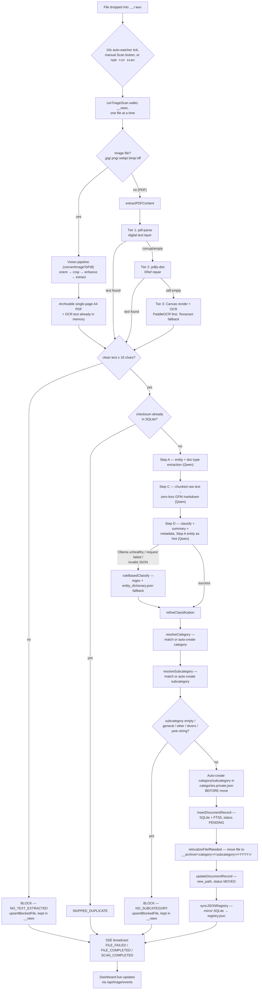

# 🏛️ Architecture

## Document flow

How one file moves from `__raws` to `__archive`, verified against `application/triage-scan.ts`, `application/convert-image-document.ts`, `application/classify-document.ts`, `domain/classification-resolution.ts`, and `domain/taxonomy.ts`. See [triage-pipeline](../workflows/triage-pipeline.md) for the numbered step-by-step version this diagram summarizes.



Notes:
- The image branch (orient → crop → enhance → extract, `application/image-to-pdf.ts`) feeds into the **same** classification path as PDFs from `G` onward — a photo is never classified differently from a scanned document, only converted first.
- `BLOCK1`/`BLOCK2` are terminal: no DB row, no move, no auto-create. The file stays in `__raws` and is skipped on future ticks via the `blocked_files` skip-cache until it changes (see [triage-pipeline](../workflows/triage-pipeline.md)).
- Golden Rule #4 is enforced at node `O`.

## Module map

```
src/
├── index.ts                              # Dispatcher: default web, `scan`, `mcp` (composition root)
├── domain/
│   ├── document.schema.ts                # Zod contracts (validation only)
│   ├── classification.ts                 # ruleBasedClassify + fallback classifier logic
│   ├── prompt.ts                         # Qwen system/user prompt building
│   ├── classification-resolution.ts      # refineClassification, resolveCategory, resolveSubcategory
│   ├── taxonomy.ts                       # isYearString, isForbiddenSubcategory, computeCanonicalPath, isPathInsideDir
│   ├── pdf-text.ts                       # cleanExtractedText
│   ├── pdf-page-fit.ts                   # fitImageToA4 — pure page geometry for photo→PDF pages
│   ├── flood-crop.ts                     # barrier-map document-boundary detector + crop admissibility (pure)
│   ├── image-adjust.ts                   # auto-levels / sharpen math
│   └── exif-orientation.ts               # EXIF Orientation tag parsing
├── application/
│   ├── classify-document.ts              # classifyPDFText (orchestrator)
│   ├── triage-scan.ts                    # runTriageScan
│   ├── convert-image-document.ts         # convertImageToPdf — photo → archivable A4 PDF + its OCR text
│   ├── image-to-pdf.ts                   # Vision Lab steps: runOrientStep/runCropStep/runEnhanceStep/runExtractStep
│   ├── repair-registry.ts                # repairRegistry
│   ├── relocalize-document.ts            # relocalizeFileIfNeeded, moveBackToRaws, reclassifyAndRelocalizeDocument
│   ├── clear-registry.ts                 # clearRegistryAndMoveArchiveToRaws
│   └── scan-lock.ts                      # acquireScanLock (cross-process lock)
├── infrastructure/
│   ├── settings.ts                       # CONFIG + settings.json load/save
│   ├── logger.ts                         # Color terminal + file logs
│   ├── categories-store.ts               # getCategoriesConfig / saveCategoriesConfig
│   ├── entity-dictionary-store.ts        # getEntityDictionary
│   ├── ollama-client.ts                  # ensureOllamaModel, checkModelCanGenerate, generateEmbedding
│   ├── pdf-extractor.ts                  # extractPDFContent() + SHA-256 checksum
│   ├── pdf-scanner.ts                    # getPDFsRecursively, getAllFilesRecursively
│   ├── pid-lock.ts                       # shared PID-lock-file helper + killProcessOnPort (cross-directory port takeover)
│   ├── json-registry.ts                  # SQLite → registry.json mirror
│   ├── db/database.ts                    # SQLite open, schema init, CRUD, FTS5
│   ├── http/web-server.ts                # Express + SSE + REST + 10s watcher
│   └── mcp/mcp-server.ts                 # MCP tools over stdio
public/                                   # UI (index.html, app.js, style.css)
```

## Ownership boundaries

| Module                                                                                                              | Owner agent                                                  | May write to                              |
| --------------------------------------------------------------------------------------------------------------------| ---------------------------------------------------------------| -------------------------------------------|
| `domain/classification.ts`, `domain/prompt.ts`, `domain/classification-resolution.ts`                              | classification-expert                                          | itself                                     |
| `application/classify-document.ts`                                                                                  | classification-expert                                          | itself, categories.json                    |
| `infrastructure/categories-store.ts`                                                                                | classification-expert                                          | itself, categories.json                    |
| `infrastructure/entity-dictionary-store.ts`                                                                         | classification-expert                                          | itself, entity_dictionary.json             |
| `infrastructure/pdf-extractor.ts`                                                                                   | pipeline-engineer                                               | itself                                     |
| `domain/taxonomy.ts`, `domain/pdf-text.ts`                                                                          | pipeline-engineer                                               | itself                                     |
| `application/triage-scan.ts`, `application/repair-registry.ts`, `application/relocalize-document.ts`, `application/clear-registry.ts`, `application/scan-lock.ts` | pipeline-engineer | itself, uses DB + AI |
| `infrastructure/json-registry.ts`                                                                                   | db-registry-keeper                                              | itself, registry.json                      |
| `infrastructure/db/database.ts`                                                                                     | db-registry-keeper                                              | itself, pdf_triage.db                      |
| `domain/document.schema.ts`                                                                                         | classification-expert (data) + db-registry-keeper (records)    | itself                                     |
| `infrastructure/http/web-server.ts`                                                                                 | pipeline-engineer                                               | itself                                     |
| `infrastructure/mcp/mcp-server.ts`                                                                                  | mcp-integrator                                                  | itself                                     |
| `public/*`                                                                                                          | ui-frontend                                                     | itself                                     |
| Ollama connectivity                                                                                                 | ollama-ops                                                      | infrastructure/ollama-client.ts (limited)  |

Cross-module edits: do them, but ping [qa-reviewer](../agents/qa-reviewer.md) via a review pass.

## Layering (domain / application / infrastructure)

`src/` is organized into three layers, each with a one-way dependency rule:

- **`src/domain/`** — pure logic, zero I/O. No `fs`, no network calls, no reading
  `CONFIG` or environment variables. Functions take data as parameters and return
  data. Includes classification rules (`classification.ts`), Qwen prompt building
  (`prompt.ts`), category/subcategory resolution (`classification-resolution.ts`),
  taxonomy/path helpers (`taxonomy.ts`), text cleanup (`pdf-text.ts`), and the Zod
  schemas (`document.schema.ts`).
- **`src/application/`** — orchestration ("use cases"). Fetches data via
  infrastructure, calls domain functions to decide what to do, calls infrastructure
  again to persist or act. This is where `classifyPDFText`, `runTriageScan`,
  `repairRegistry`, the relocalize/clear-registry flows, and the cross-process
  scan lock live.
- **`src/infrastructure/`** — all I/O adapters: SQLite (`db/database.ts`), the
  filesystem-backed settings/categories/entity-dictionary/JSON-registry stores,
  the Ollama client, the PDF extractor/scanner, the shared PID-lock helper, the
  Express HTTP server (`http/web-server.ts`), and the MCP stdio server
  (`mcp/mcp-server.ts`).

Dependency direction: `infrastructure/` and `application/` may import from
`domain/`; `domain/` never imports from the other two. `application/` may
import from `infrastructure/`. The two inbound adapters —
`infrastructure/http/web-server.ts` and `infrastructure/mcp/mcp-server.ts` —
import application use-cases to serve requests; no other infrastructure
module imports from `application/`. `src/index.ts` is the composition root
that wires everything together at startup.

This structure exists so the pure decision logic (which category, which
subcategory, is this slug grounded, what canonical path) can be unit-tested
without mocking `fs`/`CONFIG`/Ollama — see
`docs/superpowers/specs/2026-07-31-test-harness-design.md` (Phase 1) and
`docs/superpowers/specs/2026-07-31-ddd-restructure-design.md` (Phase 2, this
restructuring).

## Server startup and port takeover

Two independent layers guard `startWebServer` (`http/web-server.ts`) and `startVisionLabServer` (`vision-lab-server.ts`) against colliding with another running instance. They catch two different failure modes and are not redundant with each other:

1. **Same-directory single-instance lock** — `acquireSingleInstanceLock()` in `web-server.ts`, built on `readActiveLockHolder`/`acquireProcessLock` from `infrastructure/pid-lock.ts`. Writes this process's PID to `<BASE_DIR>/.server.lock` and refuses to start a second instance from the *same* `BASE_DIR` (e.g. a stale `tsx watch` child that hasn't exited yet, still running alongside a freshly spawned one). Each directory has its own `.server.lock`, so this lock is blind to a stale instance running from a *different* directory (e.g. a git worktree) — even one still squatting on the same TCP port. Unchanged by the port-takeover work; still Vision-Lab-agnostic (`startVisionLabServer` doesn't call it).
2. **Cross-directory / OS-level port takeover** — `killProcessOnPort(port)`, new in `infrastructure/pid-lock.ts`. `startWebServer`/`startVisionLabServer` each split into a `startXServer` + `attemptListen(port, allowTakeover)` pair. On `EADDRINUSE`, `attemptListen` calls `killProcessOnPort(port)` — which shells out to `netstat -ano -p tcp` to find the PID `LISTENING` on the port and force-kills it via `taskkill /PID <pid> /F` (Windows only) — waits ~500ms for the OS to release the socket, then retries binding exactly once, with takeover disabled on that retry so a port that genuinely can't be freed fails fast instead of looping. This layer always kills whatever holds the port, with **no check** that it's a previous instance of this same app — a deliberate simplicity tradeoff, not an oversight (see `docs/superpowers/specs/2026-08-24-dev-server-port-takeover-design.md`).

Why both layers exist: a worktree-launched instance kept running and squatted on the dev port; every later `npm run dev` from `main` silently failed to start (layer 1 can't see the cross-directory conflict) while a user unknowingly kept looking at the stale instance's dashboard — wrong `BASE_DIR`, near-empty data, looked like "all documents lost" when nothing had actually been touched. Layer 2 closes that gap by making the newer `npm run dev` win automatically instead of requiring a manual PID hunt.

## Data flow (steady state)

1. `infrastructure/http/web-server.ts` boots, static-serves `public/`, opens SSE endpoints, starts the 10 s auto-watcher.
2. Auto-watcher calls `runTriageScan(broadcast)` (`application/triage-scan.ts`) when `__raws` has PDFs.
3. `runTriageScan` walks `__raws`, for each PDF **or photo**:
   - **Photos only** — `convertImageToPdf()` (`application/convert-image-document.ts`) runs the vision pipeline
     (orient → crop → enhance → extract), writes an A4 PDF beside the photo, deletes the photo once that PDF is on disk,
     and returns `{pdfPath, checksum, rawText}`. `originalPath` is re-pointed at the PDF, and extraction below is skipped
     because the text is already in hand — otherwise the same page would be OCR'd twice.
   - `extractPDFContent()` (`infrastructure/pdf-extractor.ts`) → `{checksum, raw_text, numpages, info}`.
     OCR is PaddleOCR-first (`infrastructure/paddleocr-client.ts` → local FastAPI service), Tesseract as availability fallback.
   - Dedup check via `getDocumentByChecksum(checksum)`.
   - `classifyPDFText()` (`application/classify-document.ts`) → validated `DocumentMetadata`.
   - `insertDocumentRecord()` → SQLite + FTS5.
   - `relocalizeFileIfNeeded()` (`application/relocalize-document.ts`) → moves file to canonical path.
   - `updateDocumentRecord(id, { new_path, status: 'MOVED' })`.
   - `syncJSONRegistry()`.
4. SSE clients receive `FILE_PROGRESS`, `FILE_COMPLETED`/`FAILED`, then `SCAN_COMPLETED`.
5. UI subscribes to `/api/triage/events` and repaints pills + cards live.

## MCP path

`src/infrastructure/mcp/mcp-server.ts` exposes tools (`search_documents`, `get_full_document_text`, `update_document_metadata`, `trigger_triage`, `list_categories`) over stdio. Runs as a separate process (`npm run mcp`); shares the SQLite DB and categories.json but does NOT bring up the web server.

## SQLite tables

- `documents` — the record of truth (see [data-model](./data-model.md)).
- `documents_fts` — FTS5 virtual mirror for search. May not exist if the SQLite build lacks FTS5; all writes are wrapped in try/catch.
- `categories_db` — legacy scaffold table; the taxonomy source of truth is the JSON file `categories.json`, not this table.

## Config resolution order (highest wins)

1. `settings.json` (project-local, editable via Settings modal or `PUT /api/config`).
2. Environment variables (`PDF_INPUT_DIR`, `PDF_OUTPUT_DIR`, `PDF_REGISTRY_PATH`, `PDF_DB_PATH`, `OLLAMA_HOST`, `OLLAMA_MODEL`, `OLLAMA_EMBED_MODEL`, `PORT`).
3. Defaults in `src/infrastructure/settings.ts`.

## Threading model

Single-process Node event loop. No worker threads. Long tasks (Ollama call, PDF parse) are async I/O — the 50 ms yield between files keeps SSE and HTTP responsive.
