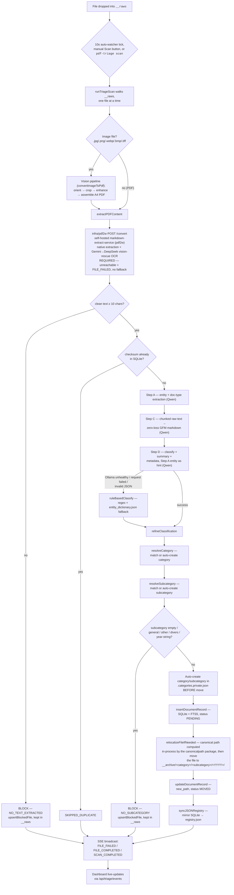

# 🏛️ Architecture

The backend is ONE static, CGO-free Go binary, `pdf-triage` (built with `make build` →
`dist/pdf-triage`), which exposes four subcommands: `serve | scan | mcp | vision-lab`. It is built
from the `services/pdf-triage-pdf2w` git submodule. TypeScript remains only for the browser
dashboard (`public/ts` → `public/js`, `public/scss` → `public/style.css`); the JS is served
statically and its REST/SSE contract is frozen (see [api-reference](./api-reference.md)).

## Document flow

How one file moves from `__raws` to `__archive`, verified against `app/triagescan`'s
`runTriageScan`, `app/convertimage`'s `convertImageToPdf`, `app/classify`'s `classifyPDFText`,
`classificationresolution`'s `refineClassification`, and `taxonomy`'s slug helpers. See
[triage-pipeline](../workflows/triage-pipeline.md) for the numbered step-by-step version this
diagram summarizes.


```mermaid
flowchart TD
    A["File dropped into <code>__raws</code>"] --> B{"10s auto-watcher tick,<br/>manual Scan button, or <code>pdf-triage scan</code>"}
    B --> C["runTriageScan walks __raws,<br/>one file at a time"]

    C --> D{"Image file?<br/>.jpg/.png/.webp/.bmp/.tiff"}

    D -- yes --> V1["Vision pipeline (convertImageToPdf):<br/>orient → crop → enhance → assemble A4 PDF"]
    V1 --> E["extractPDFContent"]

    D -- "no (PDF)" --> E

    E --> E1["infra/pdf2w POST /convert<br/>self-hosted markdown-extract-service (pdf2w)<br/>native extraction + Gemini→DeepSeek vision-rescue OCR<br/>REQUIRED — unreachable = FILE_FAILED, no fallback"]
    E1 --> G{"clean text ≥ 10 chars?"}

    G -- no --> BLOCK1["BLOCK — NO_TEXT_EXTRACTED<br/>upsertBlockedFile, kept in __raws"]
    G -- yes --> H{"checksum already<br/>in SQLite?"}
    H -- yes --> SKIP["SKIPPED_DUPLICATE"]
    H -- no --> I["Step A — entity + doc-type extraction (Qwen)"]
    I --> J["Step C — chunked raw text →<br/>zero-loss GFM markdown (Qwen)"]
    J --> K["Step D — classify + summary +<br/>metadata, Step A entity as hint (Qwen)"]
    K -- "Ollama unhealthy / request failed /<br/>invalid JSON" --> RB["ruleBasedClassify —<br/>regex + entity_dictionary.json fallback"]
    K -- success --> L
    RB --> L["refineClassification"]
    L --> M["resolveCategory —<br/>match or auto-create category"]
    M --> N["resolveSubcategory —<br/>match or auto-create subcategory"]
    N --> O{"subcategory empty /<br/>general / other / divers /<br/>year-string?"}
    O -- yes --> BLOCK2["BLOCK — NO_SUBCATEGORY<br/>upsertBlockedFile, kept in __raws"]
    O -- no --> P["Auto-create category/subcategory in<br/>.categories.private.json BEFORE move"]
    P --> Q["insertDocumentRecord —<br/>SQLite + FTS5, status PENDING"]
    Q --> R["relocalizeFileIfNeeded — canonical path computed<br/>in-process by the canonicalpath package, then move<br/>the file to __archive/&lt;category&gt;/&lt;subcategory&gt;/&lt;YYYY&gt;/"]
    R --> S["updateDocumentRecord —<br/>new_path, status MOVED"]
    S --> T["syncJSONRegistry —<br/>mirror SQLite → registry.json"]

    BLOCK1 --> SSE["SSE broadcast:<br/>FILE_FAILED / FILE_COMPLETED / SCAN_COMPLETED"]
    BLOCK2 --> SSE
    SKIP --> SSE
    T --> SSE
    SSE --> DASH["Dashboard live-updates<br/>via /api/triage/events"]
```

Notes:
- The image branch (orient → crop → enhance → assemble, `app/imagetopdf` + `app/convertimage`) feeds into the **same** classification path as PDFs from `E` onward — a photo is never classified or OCR'd differently from a scanned document, only assembled into a PDF first. Text for both comes from the same `extractPDFContent()` → pdf2w call; there is no separate OCR step for photos anymore. See [pdf2w-extraction.md](./pdf2w-extraction.md#photo-pipeline-change--no-local-ocr).
- `BLOCK1`/`BLOCK2` are terminal: no DB row, no move, no auto-create. The file stays in `__raws` and is skipped on future ticks via the `blocked_files` skip-cache until it changes (see [triage-pipeline](../workflows/triage-pipeline.md)).
- Golden Rule #4 is enforced at node `O`.
- When a TypeSafe key is configured, the optional judge runs between Step D (`K`) and
  `refineClassification` (`L`) to choose a category and a speculative subcategory from the existing
  taxonomy, plus a pre-creation existence check before the auto-create node `P`. It never touches
  Steps A/C/D; with no key the diagram above is the whole story.

## Go layer map

```
services/pdf-triage-pdf2w/
├── cmd/pdf-triage/        # composition root: serve | scan | mcp | vision-lab
│                          #   (replaces the retired TypeScript composition root and Electron shell)
├── httpapi/               # net/http REST + SSE + static public/   (replaces the retired TypeScript HTTP server)
├── mcpserver/             # MCP stdio + streamable HTTP            (replaces the retired TypeScript MCP server)
├── visionlab/             # standalone Vision Lab diagnostic server (replaces the retired TypeScript Vision Lab server)
├── app/                   # orchestration / use-cases              (replaces the retired TypeScript application layer)
│   ├── classify/          # classifyPDFText
│   ├── triagescan/        # runTriageScan
│   ├── convertimage/      # convertImageToPdf — photo → archivable A4 PDF
│   ├── imagetopdf/        # Vision Lab steps: orient/crop/enhance/extract
│   ├── repair/            # repairRegistry
│   ├── relocalize/        # relocalizeFileIfNeeded, moveBackToRaws, reclassifyAndRelocalizeDocument
│   ├── clear/             # clearRegistryAndMoveArchiveToRaws
│   ├── scanlock/          # acquireScanLock (cross-process lock)
│   ├── taskstate/         # in-memory task state
│   ├── guards/            # ONE shared Golden-Rule write-guard package
│   ├── chatplanner/       # chat query planning
│   └── aichat/            # grounded chat assistant
├── store/                 # SQLite + file stores
│   ├── database/          # SQLite open, schema init, CRUD, FTS5 — the ONLY raw-SQL site
│   ├── categories/        # categories store
│   ├── entitydictionary/  # entity_dictionary.json read
│   ├── promptpersonalization/ # .prompts.private.json read + merge
│   ├── manualdecisions/   # manual_decisions.json + SQLite read/write
│   └── taxonomyhints/     # taxonomy_hints.json
├── infra/                 # I/O adapters
│   ├── settings/          # CONFIG + settings.json load/save
│   ├── osopen/            # the ONLY package allowed to launch Explorer/Chrome (WSL-safe)
│   ├── logger/            # color terminal + rotating file logs
│   ├── ollama/            # Ollama client + `ollama serve` spawn
│   ├── typesafe/          # HTTP client for TypeSafe System One (Jev) — optional semantic judge
│   ├── pdf2w/             # HTTP client for the required external pdf2w service
│   ├── pdfextractor/      # extractPDFContent() — delegates to pdf2w, plus SHA-256 checksum
│   ├── pdfscanner/        # filesystem walk
│   ├── pidlock/           # PID-lock helper + port takeover (build-tagged per OS)
│   ├── jsonregistry/      # SQLite → registry.json mirror
│   ├── zipbuilder/        # PDF package + bulk Markdown ZIP export
│   ├── imageprocessor/    # image decode/encode
│   ├── vision/            # Ollama vision calls
│   ├── orientation/       # orientation detection
│   └── crop/              # crop detection
└── <domain packages>      # pure top-level packages, zero I/O:
                           #   taxonomy, classification, classificationresolution, prompt,
                           #   promptpersonalization, decisionrule, documentschema, pdftext,
                           #   cleantext, canonicalpath, markdowntables, extractionqualitygate,
                           #   pdfpagefit, floodcrop, imageadjust, exiforientation,
                           #   imagedimensions, chatquery, taxonomyconflicts, pathconv
public/                    # UI (index.html, public/ts → public/js, public/scss → public/style.css)
```

The former TypeScript inbound adapters are now `httpapi` and
`mcpserver`; `cmd/pdf-triage` is the composition root that wires every package at startup.

## Ownership boundaries

| Package                                                                                                             | Owner agent                                                  | May write to                              |
| ------------------------------------------------------------------------------------------------------------------- | ---------------------------------------------------------------| ------------------------------------------- |
| `classification`, `prompt`, `classificationresolution`                                                              | classification-expert                                          | itself                                     |
| `app/classify`                                                                                                      | classification-expert                                          | itself, categories.json                    |
| `store/categories`                                                                                                  | classification-expert                                          | itself, categories.json                    |
| `store/entitydictionary`                                                                                            | classification-expert                                          | itself, entity_dictionary.json             |
| `infra/pdfextractor`                                                                                                | pipeline-engineer                                               | itself                                     |
| `taxonomy`, `pdftext`, `cleantext`, `canonicalpath`                                                                 | pipeline-engineer                                               | itself                                     |
| `app/triagescan`, `app/repair`, `app/relocalize`, `app/clear`, `app/scanlock`                                       | pipeline-engineer                                               | itself, uses DB + AI                       |
| `infra/jsonregistry`                                                                                                | db-registry-keeper                                              | itself, registry.json                      |
| `store/database`                                                                                                    | db-registry-keeper                                              | itself, pdf_triage.db                      |
| `documentschema`                                                                                                    | classification-expert (data) + db-registry-keeper (records)     | itself                                     |
| `httpapi`                                                                                                           | pipeline-engineer                                               | itself                                     |
| `mcpserver`                                                                                                         | mcp-integrator                                                  | itself                                     |
| `public/*`                                                                                                          | ui-frontend                                                     | itself                                     |
| Ollama connectivity                                                                                                 | ollama-ops                                                      | infra/ollama (limited)                     |

Cross-module edits: do them, but ping [qa-reviewer](../agents/qa-reviewer.md) via a review pass.

## Layering and the dependency direction rule

The module is organized into layers, each with a one-way dependency rule. Higher layers may import
lower ones; **a lower layer never imports a higher one**:

```
domain (top-level pure packages)  →  infra/  →  store/  →  app/  →  httpapi / mcpserver / visionlab  →  cmd/pdf-triage
```

- **Domain (top-level packages)** — pure logic, zero I/O. No filesystem, no network, no reading
  `CONFIG` or environment variables. Functions take data as parameters and return data. Includes
  classification rules (`classification`), Qwen prompt building (`prompt`), category/subcategory
  resolution (`classificationresolution`), taxonomy/path helpers (`taxonomy`, `pathconv`,
  `canonicalpath`), text cleanup (`pdftext`, `cleantext`), and the validation contracts
  (`documentschema`). **Domain imports nothing above it.**
- **`infra/`** — I/O adapters: `settings`, `osopen`, `logger`, `ollama`, `typesafe`, `pdf2w`,
  `pdfextractor`, `pdfscanner`, `pidlock`, `jsonregistry`, `zipbuilder`, `imageprocessor`,
  `vision`, `orientation`, `crop`.
- **`store/`** — SQLite and file-backed stores. **Raw SQL lives only in `store/database`**; every
  other package goes through it or through a file store.
- **`app/`** — orchestration ("use cases"). It asks collaborators for what it needs through
  **small interfaces it defines itself**, not concrete packages, which is what keeps the
  use-cases testable without a live DB, a live Ollama, or a filesystem.
- **Inbound adapters** — `httpapi`, `mcpserver` and `visionlab` translate transport
  requests/events into `app/` calls. They contain no business rules.
- **`cmd/pdf-triage`** — the composition root: the only place that constructs the concrete
  `infra`/`store` implementations and injects them into `app/`.

This structure exists so the pure decision logic (which category, which subcategory, is this slug
grounded, what canonical path) can be unit-tested without mocking I/O — see
`docs/superpowers/specs/2026-07-31-test-harness-design.md` (Phase 1) and
`docs/superpowers/specs/2026-07-31-ddd-restructure-design.md` (Phase 2).

## Optional TypeSafe seams

`infra/typesafe` is a small HTTP client for TypeSafe's System One models (Jev) and the only package
that talks to `api.typesafe.ai`; there is no Go SDK, so it POSTs to `/v1/systemone` directly. It is
consumed through two narrow interfaces that the `app/` use-cases define themselves:

- **`classify.TaxonomyJudge`** (`app/classify`) — the optional taxonomy judge. When configured, the
  classifier makes one System One request to choose a category and a speculative subcategory from
  the existing taxonomy, and one existence-check request before auto-creating a category or
  subcategory. It decides placement only; Steps A/C/D still produce title, summary, date, amounts
  and markdown. See
  [classification-flow](../workflows/classification-flow.md#typesafe-decision-step-optional).
- **`aichat.Reranker`** (`app/aichat`) — the optional relevance judge over the FTS candidates. Its
  `TypeSafeReranker` scores each candidate with one `noul` in a single request and reorders the
  hits before de-duplication and truncation.

The composition root (`cmd/pdf-triage`) constructs the concrete `*typesafe.Client` and injects both
seams only when a TypeSafe API key is configured; with no key both interfaces are nil and the
pipeline behaves exactly as before.

## Server startup and port takeover

Two independent layers guard the `serve` subcommand (`httpapi`) and the `vision-lab` subcommand
(`visionlab`) against colliding with another running instance. They catch two different failure
modes and are not redundant with each other:

1. **Same-directory single-instance lock** — a lock file at `DATA_DIR/.server.lock`, built on
   `infra/pidlock`. Writes this process's PID and refuses to start a second instance from the
   *same* `BASE_DIR` (e.g. a stale process that hasn't exited yet). Each directory has its own
   `.server.lock`, so this lock is blind to a stale instance running from a *different* directory
   (e.g. a git worktree) — even one still squatting on the same TCP port. Unchanged by the
   port-takeover work; still Vision-Lab-agnostic.
2. **Cross-directory / OS-level port takeover** — `killProcessOnPort(port)` in `infra/pidlock`.
   The server splits into a start + `attemptListen(port, allowTakeover)` pair. On `EADDRINUSE`,
   `attemptListen` kills the PID on the port — on Windows via `netstat -ano -p tcp` +
   `taskkill /PID <pid> /F` in a build-tagged file, on Linux/WSL via POSIX process checks — waits
   ~500 ms for the OS to release the socket, then retries binding exactly once, with takeover
   disabled on that retry so a port that genuinely can't be freed fails fast instead of looping.
   This layer always kills whatever holds the port, with **no check** that it's a previous
   instance of this same app — a deliberate simplicity tradeoff, not an oversight (see
   `docs/superpowers/specs/2026-08-24-dev-server-port-takeover-design.md`).

Why both layers exist: a worktree-launched instance kept running and squatted on the dev port; every
later server start from `main` silently failed to start (layer 1 can't see the cross-directory
conflict) while a user unknowingly kept looking at the stale instance's dashboard — wrong `BASE_DIR`,
near-empty data, looked like "all documents lost" when nothing had actually been touched. Layer 2
closes that gap by making the newer server win automatically instead of requiring a manual PID hunt.

## Data flow (steady state)

1. `pdf-triage serve` (`cmd/pdf-triage` → `httpapi`) boots, static-serves `public/`, opens SSE endpoints, starts the 10 s auto-watcher.
2. Auto-watcher calls `runTriageScan(broadcast, shouldAbort)` (`app/triagescan`)
   when `__raws` has PDFs.

   **Serialization.** `acquireScanLock()` (`app/scanlock`) guards the whole run. It tracks
   in-process ownership *separately* from the `.scan.lock` file, because the lock holder check
   deliberately reports "free" when the file holds this same PID — so the file alone could never
   stop a second scan starting inside one process. That is exactly what happened when the user
   pressed Stop (which cleared the in-memory flag without cancelling the running loop) and then
   Scan again: two loops walked the same `__raws` listing, one moved a file to `__archive` between
   the other's directory read and its stat, and the loser of a classify race hit
   `UNIQUE constraint failed: documents.checksum` and shunted an already-archived document into
   `.duplicates_files`. The release function is idempotent for the same reason — a stale handle
   must not delete a lock a later run now owns.

   **Cancellation.** `runTriageScan` polls `shouldAbort` once per file. `POST /api/triage/unlock`
   ("Stop") sets that flag; before it existed, Stop only dropped the re-entry guard and the loop
   ran to completion underneath the user.
3. `runTriageScan` walks `__raws`, for each PDF **or photo**:
   - **Photos only** — `convertImageToPdf()` (`app/convertimage`) runs the vision pipeline
     (orient → crop → enhance → assemble), writes an image-only A4 PDF beside the photo, moves the photo to
     `__raws/.delete_files/img_converted/` once that PDF is on disk (it is never deleted — the PDF holds a cropped,
     re-encoded rendition), and calls `extractPDFContent()` on the assembled PDF for its text — the same call
     every other PDF makes below. `originalPath` is re-pointed at the PDF.
   - `extractPDFContent()` (`infra/pdfextractor`) → `{checksum, raw_text, numpages, info}`.
     A single required HTTP call (`infra/pdf2w`, `POST /convert`) to the self-hosted
     `markdown-extract-service` (pdf2w): native PDF text/table extraction, with pdf2w's own
     Gemini→DeepSeek vision-rescue OCR firing server-side for scanned or image-only pages. There is no
     in-process extraction tier, no local OCR engine, and no fallback — an unreachable or misconfigured
     `PDF2W_SERVICE_URL` throws, and that file is `FILE_FAILED`. See
     [pdf2w-extraction.md](./pdf2w-extraction.md).
   - Dedup check via `getDocumentByChecksum(checksum)`.
   - `classifyPDFText()` (`app/classify`) → validated `DocumentMetadata`.
   - `insertDocumentRecord()` → SQLite + FTS5.
   - `relocalizeFileIfNeeded()` (`app/relocalize`, computing the path in-process through the
     `canonicalpath` package) → moves the file to its canonical archive path.
   - `updateDocumentRecord(id, { new_path, status: 'MOVED' })`.
   - `syncJSONRegistry()`.
4. SSE clients receive `FILE_PROGRESS`, `FILE_COMPLETED`/`FAILED`, then `SCAN_COMPLETED`.
5. UI subscribes to `/api/triage/events` and repaints pills + cards live.

## MCP path

`mcpserver` exposes the MCP tools over stdio and Streamable HTTP. Runs as a separate process
(`pdf-triage mcp`); shares the SQLite DB and categories.json but does NOT bring up the web server.

## SQLite tables

- `documents` — the record of truth (see [data-model](./data-model.md)).
- `documents_fts` — FTS5 virtual mirror for search. May not exist if the SQLite build lacks FTS5; all writes are guarded.
- `categories_db` — legacy scaffold table; the taxonomy source of truth is the JSON file `categories.json`, not this table.

## Config resolution order (highest wins)

1. `settings.json` (project-local, editable via Settings modal or `PUT /api/config`).
2. Environment variables (`PDF_INPUT_DIR`, `PDF_OUTPUT_DIR`, `PDF_REGISTRY_PATH`, `PDF_DB_PATH`, `OLLAMA_HOST`, `OLLAMA_MODEL`, `OLLAMA_EMBED_MODEL`, `SYSTEM_LANGUAGE`, `PORT`).
3. Defaults in `infra/settings`.

## WSL path policy (Golden Rule #21)

This app runs on native Windows AND under WSL, and the two hosts need different path forms:

| Direction | Form | Where |
| --- | --- | --- |
| Config paths the app's fs reads/writes on WSL | `/mnt/<drive>/...` | normalized at load by `windowsToWslPath` (`pathconv`) |
| Paths handed to Windows programs (Explorer, Chrome) | `X:\...` | converted by `wslToWindowsPath` |

The two rules that caused real bugs before they were centralised:

1. A Windows-form path in `settings.json` (`\mnt\C:\Users\...`) made the process create literal backslash-named
   folders in the project root and scan empty stubs — "config cannot see files on Windows".
2. A POSIX `/mnt/...` path handed to `explorer.exe` made it silently open `C:\Users\<user>\Documents`.

**All OS launching** (file manager reveal/open, Chrome) goes through `infra/osopen`
— platform branching and the WSL→Windows conversion live there and only there. The hygiene test
`infra/osopen/osopen_hygiene_test.go` fails the build if an `explorer.exe` / `chrome.exe` /
`xdg-open` literal appears in any other source file. If you need a new "open X" button or tool,
call `revealInFileManager` / `openDirectory` / `openInChrome` from `infra/osopen` and spawn the
returned command yourself.

## Threading model

Single OS process, Go runtime with a goroutine-per-request HTTP server. No worker pools for the
pipeline. Long tasks (Ollama call, pdf2w call) are blocking I/O on the request/watch goroutine — the
50 ms pause between files keeps SSE and HTTP responsive.

## OCR engine fallback (removed — now pdf2w's responsibility)

Before the 2026-09-18 pdf2w extraction swap, the TypeScript `ocrPageBuffer` tried **PaddleOCR** and dropped to **Tesseract** only when that
call failed, with a lock guarding the Python service's shared model global, a retry-once-on-5xx
policy, a `/ready`-gated warm-up wait, and a page-area-scaled timeout — see git history
(`docs/superpowers/specs/2026-08-15-paddleocr-integration-design.md`) for the full account, kept
for archaeology rather than because any of it is still true.

**None of this exists anymore.** `paddleocr-server/`, the PaddleOCR client, and the local OCR
reading-order module are deleted. OCR — for scanned PDFs and for photo-derived image-only PDFs
alike — happens entirely inside the external, self-hosted `markdown-extract-service` (pdf2w) via
its own Gemini→DeepSeek vision-rescue, invisible to pdf-triage beyond the `POST /convert` call in
`infra/pdf2w`. There is no local engine to fall back between, no local lock to
manage, and no local timeout budget to tune — an unreachable pdf2w is simply `FILE_FAILED` for
that file. See [pdf2w-extraction.md](./pdf2w-extraction.md).

`ExtractedPDF.ocr_degraded` remains on the extracted result as a legacy field
(`app/relocalize` still reads it) but `extractPDFContent()` never sets it now — treat it as always
`false`. See
[Which text a re-analysis uses](../workflows/relocalize.md#which-text-a-re-analysis-uses).

**Why the old lesson still matters, generally.** The overlapping-request/silent-downgrade failure
mode this section used to document (a scan mid-OCR on one document racing a user-triggered
re-analysis on another, with the loser silently getting worse text than what was already stored) is
a real class of bug in any pipeline with more than one text-quality tier. It just no longer lives in
this codebase, because there is only one extraction path left.
